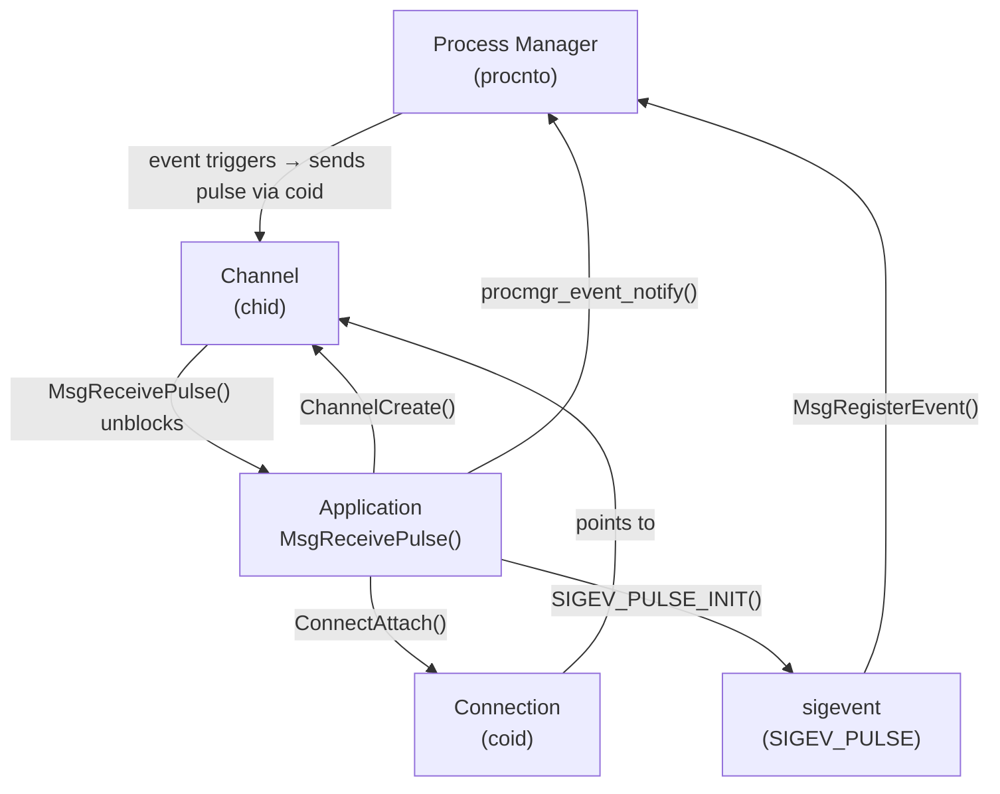
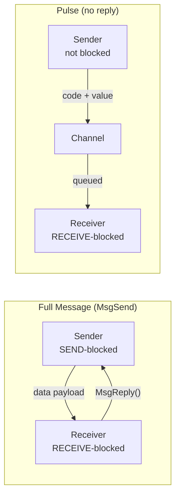
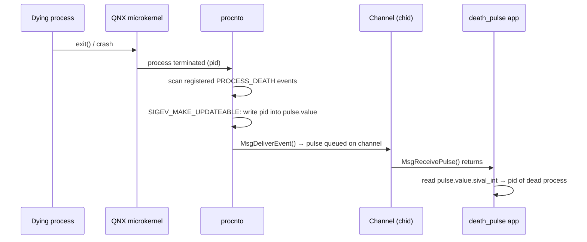

# Pulses

> Status: ✅ Complete — verified on QNX SDP 8.0, x86_64, QEMU VM.

---

## Introduction

A **pulse** is a small, fixed-size, non-blocking asynchronous notification that
the QNX microkernel can deliver to a channel. Unlike a full message
(`MsgSend()` / `MsgReply()`), a pulse carries only a 1-byte code and a
4-byte value — it never blocks the sender, requires no reply, and the
receiver does not need to be ready when the pulse is sent.

Pulses are the backbone of event-driven programming in QNX. They appear
everywhere: timer expiry, hardware interrupts, I/O completion notifications,
and — as demonstrated in this chapter — **process lifecycle events** delivered
by the Process Manager (`procnto`).

> **Coming from Linux?** The closest Linux analogy is `SIGCHLD` + `sigaction()`,
> but pulses integrate directly with the QNX message-passing architecture.
> No signal handlers, no interrupted system calls, no `SA_RESTART` headaches.
> See [Comparison with Linux](#comparison-with-linux) below.

> **Coming from AUTOSAR?** Pulses are conceptually similar to AUTOSAR OS
> events (`SetEvent()` / `WaitEvent()`), but they carry a payload and are
> delivered between independent processes rather than tasks within one
> partition.

---

## Why It Exists

In a microkernel OS, kernel components (the process manager, the interrupt
manager, device drivers) are separate processes — they cannot call directly
into application code. They need a way to notify an application of an event
**without blocking themselves** and **without requiring the application to be
ready at that exact instant**.

Pulses solve exactly this:

- The sender (e.g. `procnto`) fires a pulse and continues immediately.
- The pulse is queued on the receiver's channel.
- The receiver's thread unblocks from `MsgReceivePulse()` when it is ready.

This keeps the kernel non-blocking, avoids signal-delivery complexity, and
fits naturally into the same channel/connection model used for everything else
in QNX IPC.

---

## Architecture

### Pulse Delivery Model



### Pulse vs Full Message



The key difference: a pulse sender is **never blocked**. The pulse queues on
the channel and the receiver drains it whenever it calls `MsgReceivePulse()`.

---

## Internal Working

### The `_pulse` Structure

```c
struct _pulse {
    uint16_t  type;       /* _PULSE_TYPE */
    uint16_t  subtype;    /* _PULSE_SUBTYPE */
    int8_t    code;       /* application-defined code (1 byte) */
    uint8_t   zero[3];
    union sigval value;   /* 4-byte payload (int or pointer) */
    int32_t   scoid;      /* server connection ID */
};
```

The payload carried by a pulse is intentionally small — 1 byte of `code` plus
4 bytes of `value`. This is a deliberate design constraint: pulses are for
notifications, not data transfer. If you need to pass more data, the pulse
should signal the receiver to fetch data from shared memory.

### How `procnto` delivers a process-death pulse

When `PROCMGR_EVENT_PROCESS_DEATH` fires:



`SIGEV_MAKE_UPDATEABLE` is what allows `procnto` to stamp the PID into
the pulse value at delivery time — without it, `pulse.value` would always
contain the constant you set at initialization.

---

## API Reference

### Headers

```c
#include <sys/neutrino.h>   /* ChannelCreate, ConnectAttach, MsgReceivePulse,
                               MsgRegisterEvent, SIGEV_PULSE_INIT */
#include <sys/procmgr.h>    /* procmgr_event_notify, PROCMGR_EVENT_* */
#include <sys/siginfo.h>    /* struct sigevent, union sigval */
```

---

### `ChannelCreate()`

```c
int ChannelCreate(unsigned flags);
```

Creates a message channel owned by the calling process. Returns a channel
ID (`chid`) on success, `-1` on error.

| Flag | Meaning |
|---|---|
| `0` | Default — any process with the right nd/pid/chid can attach |
| `_NTO_CHF_PRIVATE` | Only this process can attach connections to this channel |
| `_NTO_CHF_UNBLOCK` | Allow `MsgReceivePulse()` to be unblocked by a pulse |
| `_NTO_CHF_FIXED_PRIORITY` | Receive thread inherits a fixed priority |

For process-death monitoring, use `_NTO_CHF_PRIVATE` — the channel is only
ever used internally; no external process needs to connect to it.

---

### `ConnectAttach()`

```c
int ConnectAttach(uint32_t nd, pid_t pid, int chid,
                  unsigned index, int flags);
```

Creates a connection to a channel. Returns a connection ID (`coid`) on
success, `-1` on error.

| Parameter | Purpose |
|---|---|
| `nd` | Node descriptor — `0` for local node |
| `pid` | Target process PID — `0` for calling process |
| `chid` | Channel ID to connect to |
| `index` | `_NTO_SIDE_CHANNEL` for a side channel (not a file descriptor) |
| `flags` | Usually `0` |

To connect to our own channel:

```c
coid = ConnectAttach(0, 0, chid, _NTO_SIDE_CHANNEL, 0);
```

---

### `SIGEV_PULSE_INIT()` (macro)

```c
SIGEV_PULSE_INIT(sigevent *event, int coid, int priority,
                 int code, int value);
```

Initialises a `sigevent` structure to describe a pulse notification.

| Parameter | Purpose |
|---|---|
| `event` | Pointer to the `sigevent` to initialise |
| `coid` | Connection ID — where the pulse will be sent |
| `priority` | Pulse priority (use `SIGEV_PULSE_PRIO_INHERIT` to inherit caller's priority) |
| `code` | Application-defined code byte — used to distinguish multiple pulse sources |
| `value` | Initial payload value (can be overwritten at delivery if `SIGEV_MAKE_UPDATEABLE`) |

---

### `SIGEV_MAKE_UPDATEABLE()` (macro)

```c
SIGEV_MAKE_UPDATEABLE(sigevent *event);
```

Marks the event as updateable, allowing the kernel or process manager to
overwrite `event.value` at delivery time. For process-death events, `procnto`
uses this to stamp the dead process's PID into `pulse.value.sival_int`.

> **Always call this** when subscribing to `PROCMGR_EVENT_PROCESS_DEATH` —
> without it you will receive pulses, but `pulse.value` will always be `0`.

---

### `MsgRegisterEvent()`

```c
int MsgRegisterEvent(sigevent *event, int coid);
```

Registers the event with the System Manager so that privileged kernel
components (like the process manager) are permitted to deliver it.

| Parameter | Purpose |
|---|---|
| `event` | The `sigevent` to register |
| `coid` | Connection the event will use — pass `SYSMGR_COID` for system manager |

Returns `0` on success, `-1` on error.

---

### `procmgr_event_notify()`

```c
int procmgr_event_notify(unsigned flags, const struct sigevent *event);
```

Subscribes to Process Manager lifecycle events.

| Flag | Meaning |
|---|---|
| `PROCMGR_EVENT_PROCESS_DEATH` | Notified when any process terminates |
| `PROCMGR_EVENT_PROCESS_CREATE` | Notified when any process is created (see open issue below) |
| `PROCMGR_EVENT_THREAD_CREATE` | Notified when any thread is created |
| `PROCMGR_EVENT_THREAD_DESTROY` | Notified when any thread is destroyed |

Returns `0` on success, `-1` on error.

---

### `MsgReceivePulse()`

```c
int MsgReceivePulse(int chid, void *pulse, int bytes,
                    struct _msg_info *info);
```

Blocks the calling thread until a pulse arrives on `chid`. Returns `0` on
success, `-1` on error.

| Parameter | Purpose |
|---|---|
| `chid` | Channel to receive from |
| `pulse` | Pointer to a `struct _pulse` to fill |
| `bytes` | `sizeof(struct _pulse)` |
| `info` | Optional message info — pass `NULL` for pulse-only receive |

> **`MsgReceive()` vs `MsgReceivePulse()`:** `MsgReceive()` handles both
> messages and pulses; `MsgReceivePulse()` handles only pulses. For a
> pulse-only channel, use `MsgReceivePulse()` — it is slightly lighter and
> makes the intent explicit.

---

## Example

### `death_pulse.c` — Monitor System-Wide Process Termination

Full source:

```c
/*
 * death_pulse.c
 *
 * Demonstrates QNX process-death notification using pulses.
 *
 * Setup:
 *   - Create a private channel.
 *   - Attach a connection to it.
 *   - Define a pulse event, make it updateable.
 *   - Register with the System Manager.
 *   - Subscribe to PROCMGR_EVENT_PROCESS_DEATH.
 *   - Block in MsgReceivePulse() forever.
 *
 * When any process terminates, procnto delivers a pulse whose
 * value.sival_int contains the PID of the dead process.
 *
 * Build:
 *   qcc -Vgcc_ntoaarch64le -o death_pulse death_pulse.c
 *   (or x86_64: qcc -Vgcc_ntox86_64 -o death_pulse death_pulse.c)
 *
 * Run:
 *   ./death_pulse
 *   (then in another terminal run any short-lived command, e.g. pidin)
 */

#include <stdio.h>
#include <stdlib.h>
#include <errno.h>
#include <sys/neutrino.h>
#include <sys/procmgr.h>
#include <sys/siginfo.h>

#define PULSE_CODE_DEATH    1

int main(void)
{
    int            chid;
    int            coid;
    struct sigevent ev;
    struct _pulse  pulse;
    int            ret;

    /* Step 1: Create a private channel ----------------------------------- */
    chid = ChannelCreate(_NTO_CHF_PRIVATE);
    if (chid == -1) {
        perror("ChannelCreate");
        return EXIT_FAILURE;
    }
    printf("Channel created: chid=%d\n", chid);

    /* Step 2: Attach a connection to our own channel --------------------- */
    coid = ConnectAttach(0, 0, chid, _NTO_SIDE_CHANNEL, 0);
    if (coid == -1) {
        perror("ConnectAttach");
        return EXIT_FAILURE;
    }
    printf("Connection attached: coid=%d\n", coid);

    /* Step 3: Initialise the pulse event --------------------------------- */
    SIGEV_PULSE_INIT(&ev, coid, 10, PULSE_CODE_DEATH, 0);

    /* Step 4: Make updateable so procnto can stamp the dead PID in        */
    SIGEV_MAKE_UPDATEABLE(&ev);

    /* Step 5: Register with the System Manager --------------------------- */
    ret = MsgRegisterEvent(&ev, SYSMGR_COID);
    if (ret == -1) {
        perror("MsgRegisterEvent");
        return EXIT_FAILURE;
    }
    printf("Event registered: ret=%d errno=%d\n", ret, errno);

    /* Step 6: Subscribe to PROCESS_DEATH events -------------------------- */
    ret = procmgr_event_notify(PROCMGR_EVENT_PROCESS_DEATH, &ev);
    if (ret == -1) {
        perror("procmgr_event_notify");
        return EXIT_FAILURE;
    }
    printf("Subscribed to PROCESS_DEATH: ret=%d errno=%d\n", ret, errno);

    /* Step 7: Block forever waiting for pulses --------------------------- */
    printf("Waiting for process death events...\n\n");

    for (;;) {
        ret = MsgReceivePulse(chid, &pulse, sizeof pulse, NULL);
        if (ret == -1) {
            perror("MsgReceivePulse");
            break;
        }

        if (pulse.code == PULSE_CODE_DEATH) {
            printf("Process with pid: %d died\n",
                   pulse.value.sival_int);
        }
    }

    return EXIT_FAILURE;
}
```

### Build

```bash
# ARM64 (QEMU default in SDP 8.0)
qcc -Vgcc_ntoaarch64le -g -Wall -o death_pulse death_pulse.c

# x86_64
qcc -Vgcc_ntox86_64 -g -Wall -o death_pulse death_pulse.c
```

Copy to VM and run:

```bash
scp death_pulse root@172.31.1.208:/tmp/
ssh root@172.31.1.208 /tmp/death_pulse
```

### Expected Output (startup)

```text
Channel created: chid=4
Connection attached: coid=3
Event registered: ret=0 errno=0
Subscribed to PROCESS_DEATH: ret=0 errno=0
Waiting for process death events...
```

### Experiments

#### Experiment 1 — Short-lived command

In another terminal on the VM:

```bash
pidin
```

`death_pulse` prints immediately on exit:

```text
Process with pid: 663570 died
```

`pidin` is short-lived — the moment it finishes printing its output and
returns, `procnto` fires the death event.

#### Experiment 2 — Even shorter-lived command

```bash
ls
```

```text
Process with pid: 663571 died
```

Same mechanism — `ls` exits as soon as directory listing is complete.

#### Experiment 3 — Background process with a known delay

```bash
sleep 3 &
```

Nothing happens for three seconds, then:

```text
Process with pid: 663572 died
```

This demonstrates that `MsgReceivePulse()` is truly event-driven — the
thread is BLOCKED, consuming no CPU, and only unblocks when the pulse arrives.

### Understanding the Received Pulse

```text
pulse.code            = 1          (PULSE_CODE_DEATH — what we set)
pulse.value.sival_int = 663570     (PID stamped by procnto via SIGEV_MAKE_UPDATEABLE)
```

---

## Kernel Perspective

### Process tree — running from the shell

When launched from `ksh`:

```text
pidin -P death_pulse
```

```text
   1     1  root       1  0  0  0.0  0.0 procnto
 ...
 663560  663555  root    10  0  0  0.0  0.0 ksh
 663561  663560  root    10  0  0  0.0  0.0 death_pulse
```

Parent is `ksh`. The process has one thread, RECEIVE-blocked on `chid`.

### Process tree — launched from Momentics IDE

When launched via **Run As → QNX C/C++ Application**:

```text
 ...  qconn
 ...    └── death_pulse
```

Applications launched by Momentics are spawned by `qconn` (the IDE's
target-agent process), so `qconn` appears as the parent rather than `ksh`.
This is expected — it does not affect behaviour.

### Observing the blocked thread

```bash
pidin -p <pid_of_death_pulse> threads
```

```text
pid tid name       STATE     Blocked
663561  1  death_pulse  RECEIVE   4        ← blocked on chid=4
```

`STATE=RECEIVE` and the channel ID confirm the thread is sleeping efficiently
in `MsgReceivePulse()`.

---

## Open Research Item — `PROCMGR_EVENT_PROCESS_CREATE`

> ⚠️ **Behaviour observed on SDP 8.0 — needs further investigation.**

During development, a variant was tested that registered for both
`PROCMGR_EVENT_PROCESS_CREATE` and `PROCMGR_EVENT_PROCESS_DEATH`:

```c
/* Two separate events, two separate subscriptions */
procmgr_event_notify(PROCMGR_EVENT_PROCESS_CREATE, &ev_create);
procmgr_event_notify(PROCMGR_EVENT_PROCESS_DEATH,  &ev_death);
```

Registration returned success for both:

```text
create registration=0 errno=0
create notify=0 errno=0

death registration=0 errno=0
death notify=0 errno=0
```

However, **`PROCESS_CREATE` pulses never arrived** during testing.
`PROCESS_DEATH` pulses continued to work normally.

Possible explanations:
- Requires elevated privileges (`procmgr_ability()`) on SDP 8.0.
- The event flag combination may need `PROCMGR_EVENT_PROCESS_CREATE |
  PROCMGR_EVENT_BEFORE` for proper notification.
- May be a known SDP 8.0 limitation or change in behaviour vs 7.x.

> 🔲 **TODO:** Test with explicit `PROCMGR_EVENT_BEFORE` flag. Check SDP 8.0
> release notes. Consider filing a question on QNX Foundry27 or the BSP
> support channel.

---

## Comparison with Linux

| | Linux | QNX |
|---|---|---|
| Child death notification | `SIGCHLD` signal | `PROCMGR_EVENT_PROCESS_DEATH` pulse |
| Wait for death | `waitpid()` / `wait()` | `MsgReceivePulse()` |
| Delivery mechanism | Signal (interrupts execution) | Pulse (queued on channel, explicit receive) |
| Payload | Signal number only | PID of dead process in `pulse.value.sival_int` |
| Sender blocks? | No | No |
| Receiver blocks? | `waitpid()` can block | `MsgReceivePulse()` blocks |
| Scope | Parent monitors its own children | Can monitor any process system-wide |
| Handler context | Signal handler (restricted) | Normal thread context (unrestricted) |
| Integration with select/poll | Via `signalfd` (Linux 2.6.22+) | Natural — `MsgReceivePulse()` is the select |

The QNX model is more predictable: the receiving thread is never
unexpectedly interrupted mid-execution (as can happen with signals), and the
receive loop can be combined with other pulse sources (timers, I/O, custom
events) on a single channel.

---

## Common Mistakes

### 1. Forgetting `SIGEV_MAKE_UPDATEABLE()`

```c
/* Wrong: procnto cannot stamp the PID */
SIGEV_PULSE_INIT(&ev, coid, 10, PULSE_CODE_DEATH, 0);
procmgr_event_notify(PROCMGR_EVENT_PROCESS_DEATH, &ev);

/* Correct */
SIGEV_PULSE_INIT(&ev, coid, 10, PULSE_CODE_DEATH, 0);
SIGEV_MAKE_UPDATEABLE(&ev);                          /* <-- required */
procmgr_event_notify(PROCMGR_EVENT_PROCESS_DEATH, &ev);
```

Without `SIGEV_MAKE_UPDATEABLE()`, pulses arrive but `pulse.value.sival_int`
is always `0` — you know a process died but not which one.

---

### 2. Calling `MsgReceive()` instead of `MsgReceivePulse()`

`MsgReceive()` blocks waiting for a full message first. On a channel used
only for pulses, it can behave unexpectedly. Use `MsgReceivePulse()` on
pulse-only channels.

---

### 3. Expecting a parent-child relationship

`PROCMGR_EVENT_PROCESS_DEATH` notifies of **any** process death in the
system — it does not require you to be the parent, and it does not replace
`wait()` for proper zombie reaping of your own children. If you `spawn()` or
`fork()` children, you still need to `waitpid()` to reap them; this
mechanism is for observation, not reaping.

---

### 4. Running `mkqnximage --run` from the wrong directory (environment issue)

Not a pulse API mistake, but a QNX development environment mistake that
wastes time: if the QNX SDP environment is not sourced, `qcc` is not found.
See [`../00-getting-started/qemu-vm.md`](../00-getting-started/qemu-vm.md).

---

### 5. Using `pulse.code` for the PID

The PID is in `pulse.value.sival_int`, not `pulse.code`. `pulse.code` is
the application-defined discriminator you pass to `SIGEV_PULSE_INIT()`.

```c
/* Wrong */
pid_t dead = pulse.code;            /* code is always 1 */

/* Correct */
pid_t dead = pulse.value.sival_int; /* this is the PID */
```

---

## Debugging

### Verify registration succeeded

Always check both return values immediately after registration:

```c
ret = MsgRegisterEvent(&ev, SYSMGR_COID);
printf("MsgRegisterEvent: ret=%d errno=%d\n", ret, errno);

ret = procmgr_event_notify(PROCMGR_EVENT_PROCESS_DEATH, &ev);
printf("procmgr_event_notify: ret=%d errno=%d\n", ret, errno);
```

Both should print `ret=0 errno=0`. Any non-zero `errno` here indicates a
permission or resource problem.

### Confirm the thread is blocked on the right channel

```bash
pidin -p <pid> threads
```

Look for `STATE=RECEIVE` and the correct `chid` in the blocked-on column.
If the thread shows `STATE=READY` or `STATE=RUNNING` indefinitely, the
`MsgReceivePulse()` loop is not being reached.

### Use `slogger2` / `sloginfo` for system-level events

```bash
sloginfo -w    # live, wait for new entries
```

`procnto` logs process creation and termination to the system log — useful
for cross-checking whether the event was fired at all vs whether your
registration is the problem.

### GDB — inspect the pulse struct on receive

```gdb
break main.c:65          # line of MsgReceivePulse
run
next                     # step past the call once a pulse arrives
print pulse
print pulse.code
print pulse.value.sival_int
```

---

## Interview Questions

### Q1: What is a QNX pulse and how does it differ from a full message?

**Answer:** A pulse is a small, fixed, non-blocking notification: 1 byte of
code plus 4 bytes of value. Unlike `MsgSend()`, the sender is never blocked
waiting for a reply, and there is no reply. Pulses are queued on the
receiving channel and drained by `MsgReceivePulse()`. Full messages are
synchronous (sender blocks until `MsgReply()`), carry arbitrary-length
payloads, and are used for request–response IPC. Pulses are used for events,
notifications, and timer expiry.

---

### Q2: Why is `SIGEV_MAKE_UPDATEABLE()` necessary for process-death monitoring?

**Answer:** Without it, `procnto` cannot overwrite the `value` field of the
pulse at delivery time. The pulse still arrives, but `pulse.value.sival_int`
remains whatever constant you initialised it with — so you know a death
happened but not which process died. `SIGEV_MAKE_UPDATEABLE()` grants the
kernel permission to stamp the dead process's PID into the pulse payload.

---

### Q3: Why use `MsgReceivePulse()` instead of a busy-poll or `SIGCHLD`?

**Answer:** `MsgReceivePulse()` puts the thread into `RECEIVE`-blocked state
with zero CPU usage. The thread is only scheduled when an actual pulse
arrives. A busy-poll wastes CPU and latency is still limited by poll interval.
`SIGCHLD` interrupts the thread at an arbitrary point, restricts what you
can safely do inside the handler, and only notifies the parent of its own
children. The pulse approach is event-driven, unrestricted in what you can
do on receipt, and can monitor any process in the system.

---

### Q4: What is the role of `MsgRegisterEvent()` in this flow, and why is it needed?

**Answer:** `MsgRegisterEvent()` tells the System Manager that this `sigevent`
is legitimately owned by this process and may be delivered by privileged
kernel components. Without registration, `procnto` will refuse to deliver
the pulse (permission violation). It is essentially an authorisation step —
the event must be registered before any kernel component is allowed to fire
it on the application's behalf.

---

### Q5: `PROCMGR_EVENT_PROCESS_CREATE` was registered successfully (return 0, errno 0) but no pulses arrived. What are the likely causes?

**Answer:** On SDP 8.0 this was observed as a known issue during testing.
Likely causes: (1) the `PROCMGR_EVENT_BEFORE` flag may be required in
conjunction with `PROCESS_CREATE` for the notification to fire; (2) the
calling process may lack the required `procmgr_ability()` privilege for
create notifications even though registration succeeds; (3) it may be a
regression or behavioural change in SDP 8.0 compared to 7.x. `PROCESS_DEATH`
continues to work correctly. Further investigation is ongoing.

---

## Summary

- A **pulse** is a non-blocking, fixed-size (code + value) notification
  delivered via a channel/connection pair.
- The 6-step setup is: `ChannelCreate` → `ConnectAttach` →
  `SIGEV_PULSE_INIT` → `SIGEV_MAKE_UPDATEABLE` → `MsgRegisterEvent` →
  `procmgr_event_notify`.
- `SIGEV_MAKE_UPDATEABLE()` is required for `PROCMGR_EVENT_PROCESS_DEATH`
  to stamp the dead PID into `pulse.value.sival_int`.
- `MsgReceivePulse()` blocks the thread with zero CPU usage until a pulse
  arrives — no polling, no signal handlers.
- `PROCMGR_EVENT_PROCESS_DEATH` monitors all process deaths system-wide,
  not just children.
- `PROCMGR_EVENT_PROCESS_CREATE` registered successfully on SDP 8.0 but
  did not deliver observable pulses — under investigation.
- Applications launched from Momentics appear under `qconn` in `pidin`,
  not under `ksh`.

---

## References

- QNX SDP 8.0 — [System Architecture: Interprocess Communication](https://www.qnx.com/developers/docs/8.0/com.qnx.doc.neutrino.sys_arch/topic/ipc.html)
- QNX SDP 8.0 — [Neutrino Library Reference: `MsgReceivePulse()`](https://www.qnx.com/developers/docs/8.0/com.qnx.doc.neutrino.lib_ref/topic/m/msgreceivepulse.html)
- QNX SDP 8.0 — [Neutrino Library Reference: `procmgr_event_notify()`](https://www.qnx.com/developers/docs/8.0/com.qnx.doc.neutrino.lib_ref/topic/p/procmgr_event_notify.html)
- QNX SDP 8.0 — [Neutrino Library Reference: `SIGEV_PULSE_INIT()`](https://www.qnx.com/developers/docs/8.0/com.qnx.doc.neutrino.lib_ref/topic/s/sigev_pulse_init.html)
- Related chapter: [`channels.md`](channels.md) — how channels work internally
- Related chapter: [`connections.md`](connections.md) — `ConnectAttach()` in depth
- Related chapter: [`messages.md`](messages.md) — full message passing vs pulses
- Related chapter: [`../02-process-thread/signals.md`](../02-process-thread/signals.md) — Linux `SIGCHLD` comparison
- Related chapter: [`../02-process-thread/wait.md`](../02-process-thread/wait.md) — `waitpid()` vs pulse-based monitoring
- Lab: [`../../labs/lab05-pulses/`](../../labs/lab05-pulses/) — runnable death_pulse lab

---
[⬅ Back to section index](README.md) · [⬅ Back to docs index](../README.md)
